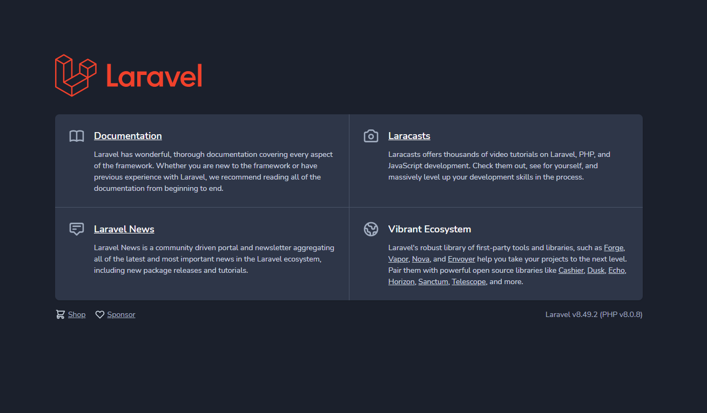
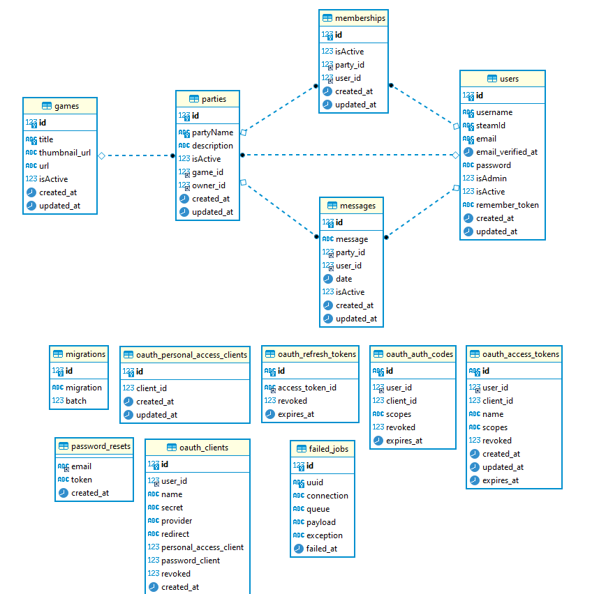
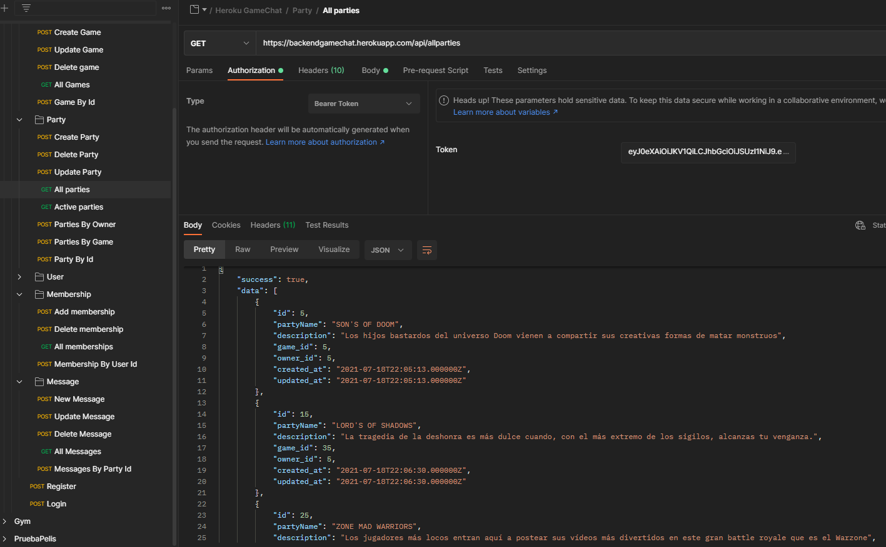

# GAME CHAT BACKEND

## Project details

### This is a Laravel PHP Back-End project from Fullstack Developer Bootcamp at <a href="https://geekshubsacademy.com/">GeeksHubs Academy</a> 2021. On this project I created a chat back-end database and structure for games platform.
 

- Start date: 12 July 2021
- Delivery date: 18 July 2021
- Dedicated time: < 40 hours 

 

## Access to Heroku deploy
https://backendgamechat.herokuapp.com/

 

## Tech

- PHP 
- LARAVEL PHP 
- POSTMAN 
- SEQUELIZE 
- DBEAVER 
- HEROKUAP 

  

## Guide

 

- [Install](#install)

- [Instructions](#instructions)

  

  

***
## <a name="install">Install</a>
***
 

- Clone or download the github project from <a href="https://github.com/VicenteAparicio/FSD_GameChat">here</a>

- Deploy on your cloud service (like Herokuapp).

- Install from composer: <code>composer install</code>

- Migrate the tables: <code>php artisan migrate</code>

- Install Passport: <code>php artisan Passport:install</code>

- Generate key: <code>php artisan key:generate</code>

- Register user and change isAdmin to true on database.

- Add the list of games you like.

- Let the users create their owns parties and join them to talk about their favourite games.

- Manage all the system from the comodity of your GOD ADMIN user.

  

### STRUCTURE DIAGRAM
 
  

***
## <a name="instructions">Instructions</a>
***
 

Anybody can register and log into their accounts. Check all the parties and join to the conversation. Users can create, modify and delete parties, they can join to their parties or parties created by others users and send messages. If they want, they can delete their own messages, parties and account too. 
 
 

## REGISTER AND LOGIN
- Route::post /register
- Route::post /login'

## ROUTES PARTY
- Route::post /deleteparty
- Route::post /updateparty
- Route::get /allparties
- Route::get /activeparties
- Route::post /partiesbyowner
- Route::post /partiesbygame
- Route::post /partybyid
## MEMBERSHIP ROUTES
- Route::post /addmember
- Route::post /deletemember
- Route::get /allmemberships
- Route::post /membershipbyuserid
## MESSAGE ROUTES
- Route::post /newmessage
- Route::post /deletemessage
- Route::post /updatemessage
- Route::get /allmessages
- Route::post /messagesbypartyid
## USER ROUTES
- Route::post /updateuser
- Route::post /deleteuser
- Route::get /allusers
- Route::get /activeusers
- Route::post /userbyid
- Route::post /userbyname
- Route::post /userbysteamid
## GAME ROUTES
- Route::post /addgame
- Route::post /deletegame
- Route::post /updategame
- Route::get /allgames
- Route::post /gamebyid

 

  

***
### Stuff I left behind
***
 
I would like to have more time to develop a entire system for a good game chat system: 
  

 - Create an entire Front-End application
 - Add friend system
 - Add report system
 - Add a ranked friendly system for users who help another users
 - Etc

  
 ***
### THANKS
***
 
To my classroom mates and teachers, and every single one who contribute to make this comunity bigger step by step.
